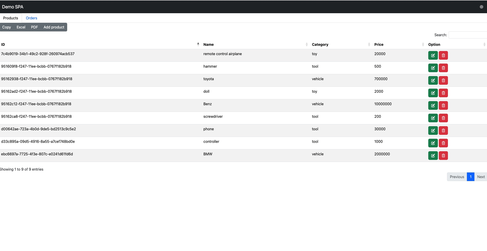
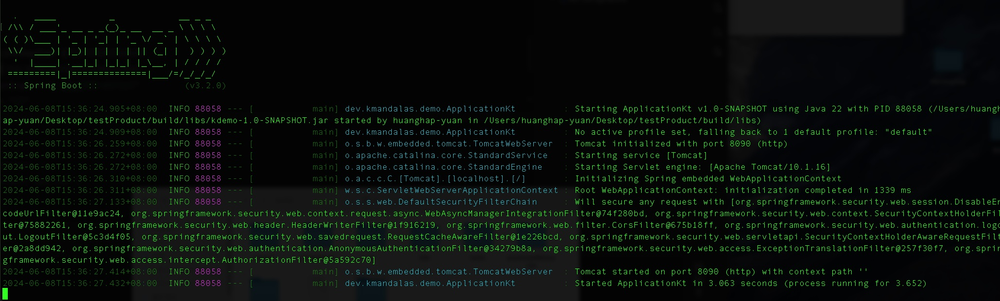

# Kotlin/JS with Spring Boot

這個練習的專案參考了
[Going full-stack with Kotlin/JS and Spring Boot](https://dzone.com/articles/going-full-stack-with-kotlinjs-and-spring-boot)
以及它在[github](https://github.com/kmandalas/spring-boot-kotlinJS)
上的檔案，參考了[Spring Boot 零基礎入門](https://ithelp.ithome.com.tw/users/20151036/ironman/6130)，完成了Spring中rest api的實作以及Controller-Service-Dao 三層式架構，也成功進行了mySQL的建構。前端的部分為了方便移除了登入功能，加入修改與刪除單筆資料的按鍵。整個前後端架構曾經在AWS的EC2服務下進行驗證，確定能夠正常運作。

